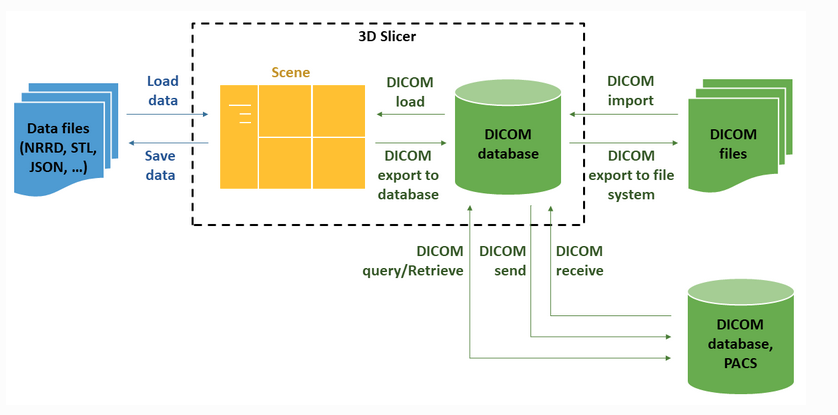

# dicom2niigzBy3DSlicer

## Description
This is a tool for converting DICOM files to NIfTI(nii.gz) format using 3DSlicer.

## Installation
Clone this repository: `git clone https://github.com/username/dicom2niigzBy3DSlicer.git`

## 3D SlicerにおけるDICOMデータベースの概要
